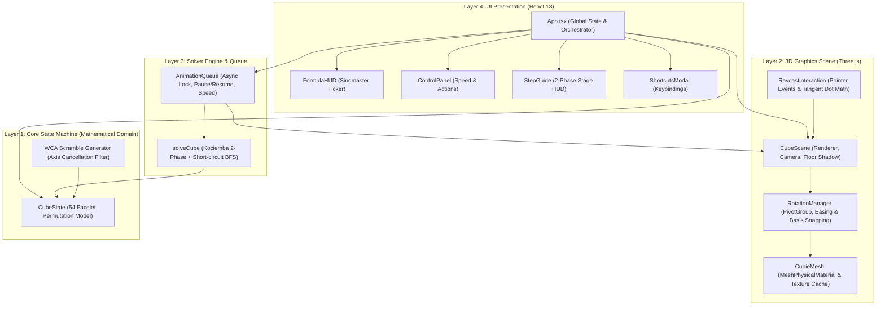

# 🧊 Rubik's Solver 3D — Intelligent 3D Visualizer & Optimal Solver

<div align="center">


<p align="center">
  <b>군론(Group Theory) 기반 상태 모델링과 Kociemba 2-Phase 최적 경로 알고리즘을 탑재한<br>프로덕션 레벨 3D 루빅스 큐브 시뮬레이터 & 지능형 자동 복원 엔진</b>
</p>

[✨ 핵심 기능](#-핵심-기능) • [📐 4계층 시스템 아키텍처](#-시스템-아키텍처) • [🧠 수학적 배경 & 알고리즘](#-수학적-배경--kociemba-2-phase-알고리즘) • [🛠️ 엔지니어링 특징](#-엔지니어링-하이라이트) • [🚀 빠른 시작](#-빠른-시작)

</div>

---

## 📌 프로젝트 개요 (Overview)

**Rubik's Solver 3D**는 WebGL 3D 그래픽스 파이프라인과 순수 상태 머신, 그리고 군론(Group Theory) 기반 최적화 알고리즘을 결합한 웹 기반 루빅스 큐브 시뮬레이터 & 최적 솔버 엔진입니다.

루빅스 큐브의 상태 공간인 약 $4.3252 \times 10^{19}$개의 방대한 경우의 수를 분할 정복(Divide and Conquer)하는 **Kociemba 2-Phase 알고리즘**을 통해, 어떤 무작위 스크램블 상태에서도 **신의 숫자(God's Number, 20수)에 근접한 20수 내외의 최단 공식**을 밀리초(ms) 단위로 도출하여 실시간 3D 애니메이션으로 단계별 복원 과정을 시각화합니다.

---

## ✨ 핵심 기능 (Key Features)

- **WCA(World Cube Association) 표준 22수 스크램블 생성기**: 동일 면 연속 회전(`R R`) 및 동일 축 상쇄 회전(`R L R'`)을 수학적으로 원천 차단한 공식 규격 무작위 시퀀스 생성.
- **Kociemba 2-Phase 최적 해법 엔진**: $G_0 \to G_1 \to I$ 하위군 환원 단계를 거쳐 20수 내외의 최단 복원 경로 산출.
- **$O(1)$ Short-circuit BFS 브루트포스 최적화**: 1~2수 이내로 복원 가능한 상태는 Kociemba 분할 단계 없이 즉각적인 최단 역회전 공식 도출.
- **MeshPhysicalMaterial 기반 물리(PBR) 텍스처 렌더링**:
  - `MeshPhysicalMaterial` 기반 클리어코트 및 거칠기(Roughness) 질감 시뮬레이션.
  - ACESFilmic 톤매핑 및 512x512 해상도의 라운디드 타일 캔버스 절차적 텍스처 생성.
  - 바닥 접촉 소프트 섀도우(Contact Shadow) 및 3점 조명 스튜디오 세팅.
- **정밀 Raycasting 마우스/터치 드래그 인터랙션**:
  - 카메라 시점과 큐브 표면의 3D 탄젠트 벡터를 2D 화면 좌표계로 투영한 내적(Dot Product) 분석으로 직관적인 면 회전 감지.
  - `OrbitControls`와의 제스처 간섭을 격리하여 큐브 표면 드래그는 면 회전, 큐브 외곽 드래그는 카메라 궤도 회전 분리.
- **비동기 애니메이션 큐(Async Animation Queue)**:
  - 락(Lock), 일시정지(Pause), 재개(Resume), 즉시 폐기(Clear)를 지원하는 비동기 제어 큐.
  - 회전 속도 슬라이더 지원 (60ms 초고속 ~ 800ms 슬로우 모션).
  - 일시정지 중 사용자 수동 개입 시 기존 복원 큐 무효화 및 54 Facelet 상태 실시간 정합성 보장.
- **클로드(Claude) 스타일 웜 미니멀 디자인 시스템**:
  - 과한 네온을 배제한 따뜻한 에스프레소 다크(`#181816`, `#1F1E1D`) 및 테라코타 클레이(`#CC785C`) 팔레트.
  - 실시간 Singmaster 노테이션 티커 HUD, 활성 공식 자동 중앙 스크롤, 진행률 프로그레스 바.
  - 전역 키보드 단축키 지원 (`Space`: 자동 맞춤 토글, `S`: 섞기, `R`: 초기화, `Esc`: 단축키 창 닫기).

---

## 📐 시스템 아키텍처 (System Architecture)

본 프로젝트는 단일 책임 원칙(SRP)과 엄격한 단방향 의존성 흐름을 따르는 **4계층 클린 아키텍처**로 설계되었습니다.



### 계층별 역할 및 책임 (Separation of Concerns)

| 레이어 | 주요 모듈 | 의존성 방향 | 핵심 책임 |
| :--- | :--- | :--- | :--- |
| **Layer 1: Core State** | `CubeState.ts`<br>`scramble.ts` | 순수 TypeScript (외부 프레임워크 무의존) | 54 Facelet 치환 상태 관리, WCA 유효 스크램블 생성, 솔브 여부 판별 |
| **Layer 2: 3D Scene** | `CubeScene.ts`<br>`RotationManager.ts`<br>`RaycastInteraction.ts` | Three.js | WebGL 렌더 파이프라인, 포인터 광선 추적, 피벗 회전 및 직교 기저 행렬 스냅 |
| **Layer 3: Solver & Queue** | `solver.ts`<br>`AnimationQueue.ts` | Core State, `cubejs` | Kociemba 2단계 알고리즘, Short-circuit 1~2수 탐색, 비동기 스텝 스케줄링 |
| **Layer 4: UI Overlay** | `App.tsx`<br>`FormulaHUD.tsx`<br>`ControlPanel.tsx` | React 18, Tailwind CSS | 사용자 인터랙션, 상태 바인딩, 키보드 이벤트, `React.memo` 리렌더링 최적화 |

---

## 🧠 수학적 배경 & Kociemba 2-Phase 알고리즘

### 1. 루빅스 큐브의 상태 공간 (State Space)

$3 \times 3 \times 3$ 루빅스 큐브의 가능한 순열 상태 수는 다음과 같습니다:

$$|G| = \frac{8! \cdot 3^8 \cdot 12! \cdot 2^{12}}{2 \cdot 3 \cdot 2} = 43{,}252{,}003{,}274{,}489{,}856{,}000 \approx 4.33 \times 10^{19}$$

- **코너 조각 위치 및 방향**: $8! \cdot 3^7$ (마지막 코너 방향은 종속)
- **엣지 조각 위치 및 방향**: $\frac{12! \cdot 2^{11}}{2}$ (마지막 엣지 플립 및 순열 패리티 종속)

단순한 BFS(너비 우선 탐색)나 $A^*$ 알고리즘을 전체 상태 공간에 직접 적용하면 지수 함수적인 메모리 폭발($O(b^d)$)로 인해 브라우저 환경에서 실시간 탐색이 불가능합니다.

### 2. Kociemba의 2단계 분할 정복 (Two-Phase Algorithm)

Herbert Kociemba 교수가 1992년에 고안한 2-Phase 알고리즘은 거대한 루빅스 큐브 군 $G_0$를 특별한 하위군 $G_1$으로 먼저 환원한 뒤 최종 단위원(Identity $I$)을 복원하는 2단계 접근법을 취합니다.

```
       Phase 1 (최대 12수)                 Phase 2 (최대 18수)
G₀ ─────────────────────────> G₁ ─────────────────────────> I (Solved)
<U, D, L, R, F, B>            <U, D, R², L², F², B²>
```

#### Phase 1: 하위군 $G_1$으로의 축소 ($G_0 \to G_1$)
- **허용 회전군**: 모든 18가지 기본 회전 $\langle U, D, L, R, F, B, U', D', L', R', F', B', U^2, \dots \rangle$
- **목표 상태**:
  1. 모든 12개 엣지의 방향성(Edge Orientation, EO) 정렬 $\to 2^{11} = 2{,}048$
  2. 모든 8개 코너의 방향성(Corner Orientation, CO) 정렬 $\to 3^7 = 2{,}187$
  3. 중간 슬라이스(E-Slice)의 4개 엣지가 UD 레이어로 이탈하지 않고 중간 슬라이스 내에 위치 $\to \binom{12}{4} = 495$
- **Phase 1 잉여류(Coset) 공간 크기**:
  $$2{,}048 \times 2{,}187 \times 495 = 2{,}217{,}093{,}120 \approx 2.21 \times 10^9$$
  이 상태에 도달하면 모든 조각의 방향이 정규화되어, 이후에는 $R^2, L^2, F^2, B^2$와 같은 $180^\circ$ 회전과 $U, D$ 회전만으로 큐브를 조작할 수 있는 하위군 $G_1$에 진입합니다.

#### Phase 2: 슬롯 정렬 및 완전 복원 ($G_1 \to I$)
- **허용 회전군**: $G_1 = \langle U, D, R^2, L^2, F^2, B^2 \rangle$ (방향성을 파괴하지 않는 보존군)
- **Phase 2 상태 공간 크기**:
  $$8! \times 8! \times 4! \approx 1.95 \times 10^{10}$$
- 코너 순열과 엣지 순열을 축소된 군 안에서 IDA*(Iterative Deepening A*)를 통해 탐색하여, 평균 10수 내외로 완전 복원 상태($I$)에 도달합니다.

### 3. $O(1)$ Short-Circuit 브루트포스 계층

Kociemba 알고리즘은 분할 정복 특성상 1수만 섞인 단순한 상태에서도 Phase 1/Phase 2의 테이블 분할로 인해 8~10수의 불필요하게 긴 공식을 반환하는 한계가 있습니다.
이를 방지하기 위해 솔버 진입 전 **Short-circuit 사전 탐색**을 배치했습니다:
- **Depth 1 검사 (18개 경우의 수)**: $R \to R'$ 등 1수 즉시 복원
- **Depth 2 검사 (270개 경우의 수)**: $R\ U \to U'\ R'$ 등 2수 즉시 복원
- $10^{-4}$초 이내에 직관적인 역회전을 찾아내어 사용자 경험을 비약적으로 향상시킵니다.

---

## 🛠️ 엔지니어링 하이라이트 (Engineering Highlights)

### 1. 부동소수점 오차 누적을 원천 차단하는 직교 기저 행렬 스냅 (Matrix Orthogonal Snapping)
WebGL 환경에서 삼각함수 기반의 오일러 회전을 수백 회 반복하면 부동소수점 오차($\epsilon$)가 누적되어 큐비의 틈이 벌어지거나 비틀리는 짐벌 락(Gimbal Lock) 및 매트릭스 왜곡이 발생합니다.
[RotationManager.ts](file:///Users/ham-uichan/Desktop/project/rubiks-solver-3d/src/scene/RotationManager.ts)는 회전이 완료되는 즉시 다음 수학적 스냅 알고리즘을 실행합니다:
1. **위치 벡터 정수화**: $x, y, z \in \{-1, 0, 1\}$ 최근접 정수 좌표 스냅.
2. **Gram-Schmidt 직교 정규화 기저 행렬 재구성**: 회전 쿼터니언으로부터 추출한 주축 벡터($\vec{X}, \vec{Y}$)를 정규화하고 외적($\vec{Z} = \vec{X} \times \vec{Y}$)을 통해 완벽한 $3 \times 3$ 직교 기저 행렬(Orthogonal Basis Matrix)을 복원하여 쿼터니언을 재설정합니다.

### 2. WebGL GPU VRAM 메모리 누수 방지 (Resource Disposal Lifecycle)
SPA 환경에서 컴포넌트 마운트/언마운트 시 발생하기 쉬운 Three.js 메모리 누수를 완벽히 차단했습니다:
- 26개 큐비의 `BoxGeometry` 및 156개 `MeshPhysicalMaterial` 전수 `dispose()`.
- 512x512 라운디드 타일 절차적 텍스처 캐시(`textureCache`) 및 바닥 그림자 `CanvasTexture` 해제.
- 회전 애니메이션 루프 중단 시 고아 rAF가 남지 않도록 `cancelAnimationFrame` 안전 캔슬러 연동.

### 3. 모바일 터치 제스처 격리 (`touch-action: none`)
모바일 기기(iOS Safari / Chrome Android)에서 터치 회전 시 브라우저 기본 스크롤, 바운스 효과, 새로고침 제스처가 Three.js 포인터 이벤트를 가로채지 못하도록 캔버스 컨테이너에 `touch-none`을 적용하고, 모바일 세로 뷰포트에서는 `flex-col lg:flex-row` 반응형 레이아웃으로 3D 터치 뷰포트의 최소 높이(350px)를 보장합니다.

### 4. 렌더 루프와 React 상태의 완전한 격리
- Three.js의 60FPS 애니메이션 루프(`renderLoop`)는 React 가상 DOM 바깥에서 독립 실행됩니다.
- 회전이 진행되는 동안 React 전역 상태 변경을 유발하지 않으며, `FormulaHUD`, `ControlPanel`, `StepGuide`, `Header` 등 모든 UI 서브 컴포넌트를 `React.memo`로 감싸 불필요한 리렌더링 비용을 0으로 통제했습니다.

### 5. 100% 정적 타입 안정성 (Zero `any`)
전체 소스코드에서 `any` 및 타입 단언(`as any`)을 단 한 건도 사용하지 않고, 54 Facelet, WCA 노테이션, 회전 방향, 솔브 플랜 타입을 엄격하게 정의했습니다.

---

## 📋 Singmaster 회전 표기법 (Notation Reference)

| 기호 | 회전 대상 면 | 회전 각도 및 방향 | 설명 |
| :---: | :---: | :---: | :--- |
| **U** / **U'** / **U2** | **Up** (윗면, White) | $+90^\circ$ / $-90^\circ$ / $180^\circ$ | 상단 레이어 시계 / 반시계 / 반전 회전 |
| **D** / **D'** / **D2** | **Down** (아랫면, Yellow) | $+90^\circ$ / $-90^\circ$ / $180^\circ$ | 하단 레이어 시계 / 반시계 / 반전 회전 |
| **F** / **F'** / **F2** | **Front** (앞면, Green) | $+90^\circ$ / $-90^\circ$ / $180^\circ$ | 전면 레이어 시계 / 반시계 / 반전 회전 |
| **B** / **B'** / **B2** | **Back** (뒷면, Blue) | $+90^\circ$ / $-90^\circ$ / $180^\circ$ | 후면 레이어 시계 / 반시계 / 반전 회전 |
| **L** / **L'** / **L2** | **Left** (왼쪽면, Orange) | $+90^\circ$ / $-90^\circ$ / $180^\circ$ | 좌측 레이어 시계 / 반시계 / 반전 회전 |
| **R** / **R'** / **R2** | **Right** (오른쪽면, Red) | $+90^\circ$ / $-90^\circ$ / $180^\circ$ | 우측 레이어 시계 / 반시계 / 반전 회전 |

---

## 📁 프로젝트 디렉터리 구조 (Directory Structure)

```
rubiks-solver-3d/
├── src/
│   ├── core/                        # [Layer 1] 순수 도메인 상태 머신
│   │   ├── CubeState.ts             # 54 Facelet 순열 상태 관리 및 판별
│   │   ├── CubeState.test.ts        # 상태 치환 및 불변식 단위 테스트
│   │   ├── constants.ts             # Facelet 인덱싱, 컬러 및 순열 상수
│   │   ├── scramble.ts              # WCA 22수 무작위 스크램블 생성기
│   │   ├── scramble.test.ts         # 스크램블 축 상쇄 방지 검증
│   │   └── types.ts                 # 핵심 유니온 및 인터페이스 정의
│   │
│   ├── scene/                       # [Layer 2] Three.js 3D 씬 파이프라인
│   │   ├── CanvasView.tsx           # React-Three.js 브리지 래퍼 컴포넌트
│   │   ├── CubeScene.ts             # 씬, 카메라, 조명, 그림자 및 생명주기 관리
│   │   ├── CubieMesh.ts             # 26개 큐비 생성, 물리 머티리얼, 텍스처 캐시
│   │   ├── RotationManager.ts       # 피벗 회전 그룹, 이징 보간, 직교 기저 스냅
│   │   ├── RaycastInteraction.ts    # 포인터 광선 추적 및 3D 탄젠트 투영 내적 해석
│   │   ├── constants.ts             # 큐비 규격, 갭, 컬러 팔레트 상수
│   │   └── types.ts                 # 3D 씬 내부 좌표 및 드래그 상태 인터페이스
│   │
│   ├── solver/                      # [Layer 3] 솔버 알고리즘 & 비동기 큐
│   │   ├── solver.ts                # Kociemba 2-Phase 연동 및 Short-circuit BFS
│   │   ├── solver.test.ts           # 솔버 정확도 및 WCA 복원 무결성 테스트 (9개)
│   │   ├── AnimationQueue.ts        # 락, 일시정지, 속도 조절 비동기 큐 엔진
│   │   └── types.ts                 # SolvePlan, SolveStep, Listener 인터페이스
│   │
│   ├── ui/                          # [Layer 4] React UI 오버레이 (클로드 스타일)
│   │   ├── Header.tsx               # 상단 타이틀, SOLVED 뱃지, 단축키 버튼
│   │   ├── FormulaHUD.tsx           # 하단 Singmaster 공식 티커 및 프로그레스 바
│   │   ├── ControlPanel.tsx         # 섞기/맞춤 메인 버튼, 속도 슬라이더, 키패드
│   │   ├── StepGuide.tsx            # 실시간 가이드 카드 및 2-Phase 단계 뷰
│   │   ├── ShortcutsModal.tsx       # 단축키 안내 팝업 모달
│   │   └── moveDescriptions.ts     # 공식별 한국어 설명 사전
│   │
│   ├── App.tsx                      # 최상위 통합 오케스트레이터 컴포넌트
│   ├── main.tsx                     # React 엔트리포인트
│   ├── index.css                    # Tailwind CSS 및 커스텀 타이포그래피
│   └── cubejs.d.ts                  # cubejs 라이브러리 타입 선언 파일
│
├── public/                          # 정적 에셋
├── package.json                     # 의존성 및 스크립트 설정
├── tsconfig.json                    # TypeScript 컴파일러 설정 (strict: true)
├── tailwind.config.js               # Tailwind CSS 커스텀 테마 구성
└── vite.config.ts                   # Vite 번들러 빌드 설정
```

---

## 🚀 빠른 시작 (Getting Started)

### 요구 사양 (Prerequisites)
- **Node.js**: `v18.0.0` 이상 권장
- **npm**: `v9.0.0` 이상

### 1. 저장소 복제 및 의존성 설치
```bash
git clone https://github.com/ham-uichan/rubiks-solver-3d.git
cd rubiks-solver-3d
npm install
```

### 2. 로컬 개발 서버 실행
```bash
npm run dev
```
브라우저에서 `http://localhost:3000`으로 접속하여 즉시 3D 루빅스 큐브를 조작할 수 있습니다.

### 3. 단위 테스트 실행 (Vitest)
전체 19개 단위 테스트(상태 머신, WCA 스크램블러, Kociemba 솔버, 비동기 큐, 예외 방어)를 실행합니다:
```bash
npm test
```

### 4. 프로덕션 빌드 및 미리보기
```bash
npm run build
npm run preview
```

---

## ⌨️ 단축키 안내 (Keyboard Shortcuts)

| 단축키 | 기능 설명 |
| :---: | :--- |
| <kbd>Space</kbd> | 자동 맞춤 시작 / 일시정지 / 재개 (Play / Pause / Resume) |
| <kbd>S</kbd> | WCA 규격 22수 무작위 섞기 (Scramble) |
| <kbd>R</kbd> | 큐브 초기 상태 원위치 리셋 (Reset to Solved) |
| <kbd>Esc</kbd> | 단축키 안내 창 닫기 |
| **마우스/터치 드래그 (큐브 위)** | 큐브 개별 면 90° 물리 회전 조작 |
| **마우스/터치 드래그 (큐브 밖)** | 3D 씬 전체 궤도(시점) 360° 자유 회전 |

---

## 📄 라이선스 (License)

This project is licensed under the **MIT License** — see the [LICENSE](LICENSE) file for details.
